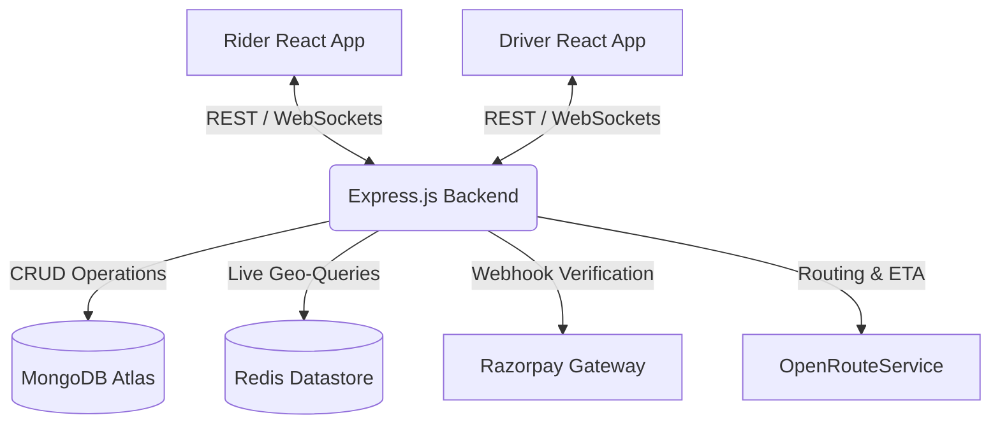
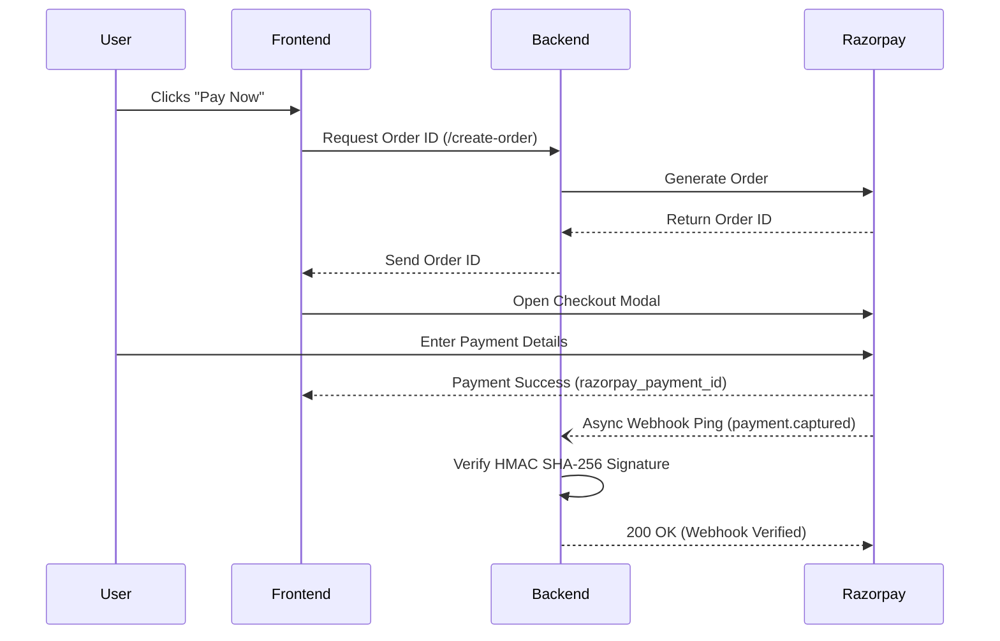

<div align="center">

# 🚖 Uber Clone Architecture

**A Production-Grade Ride Hailing Platform**

[](https://reactjs.org/)
[](https://nodejs.org/)
[](https://mongodb.com/)
[](https://redis.io/)
[](https://socket.io/)
[](https://docker.com/)

> A highly scalable, distributed ride-hailing application built with the **MERN Stack**, **Redis**, and **WebSockets**. Designed to simulate the real-time architectural complexity of modern ride-sharing platforms like Uber and Lyft.

</div>

---

## 📖 About the Project

This is not just another frontend UI clone. This project is a deep dive into **Backend Engineering, Distributed Systems, and Real-Time Event Driven Architecture**. 

The emphasis is on building a modular backend that follows strict industry-standard software engineering principles, handling everything from secure cryptographic payments to live geospatial indexing.

### 🔥 Key Architectural Achievements
- **Real-Time Geolocation Engine:** Utilizes **Redis Geospatial Indexing** (`GEOADD`, `GEORADIUS`) to store and query live driver coordinates with sub-millisecond latency.
- **Bi-Directional Event Streaming:** Orchestrates real-time ride state synchronization across dual client apps (Rider & Driver) using **Socket.io**.
- **Cryptographic Webhooks:** Integrated **Razorpay** payment gateway with HMAC SHA-256 webhook signature verification.
- **Containerized Infrastructure:** Backend and Redis datastore are fully containerized using **Docker** and orchestrated via `docker-compose`.
- **Dynamic Routing:** Integrated with **OpenRouteService** (OSRM) to calculate optimized routes, ETAs, and dynamic pricing based on distance/duration.

---

## 🏗️ System Architecture



---

## ✨ Features

### 🔐 Security & Authentication
- Secure **JWT-based** Authentication for Riders and Captains.
- Password encryption via `bcrypt`.
- Custom authentication middleware for protected API routes.

### 🚖 Ride Lifecycle Management
- **State Machine:** Robust ride status progression (`Requested` ➜ `Accepted` ➜ `Arrived` ➜ `Ongoing` ➜ `Completed`).
- **Secure Boarding:** OTP generation and verification to ensure riders enter the correct vehicle.

### 🗺️ Live Mapping & Fares
- **Address Autocomplete:** Instant location searching.
- **Dynamic Pricing Engine:** Calculates base fare, per-km, and per-minute costs in real-time.
- **Polyline Rendering:** Draws accurate, road-mapped routes between pickup and destination.

### 💳 Cryptographic Payment Workflow (Razorpay)


---

## 💻 Complete Technology Stack

| Category | Technology | Purpose |
|-----------|------------|---------|
| **Frontend** | React (Vite) + Tailwind CSS | Lightning fast, responsive dual user interfaces |
| **Backend** | Node.js + Express.js | Highly concurrent REST API layer |
| **Database** | MongoDB + Mongoose | Persistent storage for Users, Drivers, and Ride History |
| **In-Memory Store** | Redis | Caching and lightning-fast Geospatial indexing |
| **Real-Time** | Socket.IO | Live bi-directional communication between clients |
| **Payments** | Razorpay | Production payment gateway + Webhooks |
| **Geospatial** | OpenRouteService | Routing, Polylines, and Coordinates |
| **DevOps** | Docker + Docker Compose | Containerized backend infrastructure |

---

## 🚀 Running the Project (Locally)

### 1. Start the Backend Infrastructure (Docker)
Ensure you have Docker Desktop running, then spin up the Node.js backend and Redis instance simultaneously:
```bash
cd backend
docker-compose up --build
```

### 2. Start the Rider App
```bash
cd frontend/rider
npm install
npm run dev
```

### 3. Start the Driver App
```bash
cd frontend/driver
npm install
npm run dev
```

---

## 📊 Project Completion Status

| Module | Status |
|---------|--------|
| **Authentication & Middleware** | ✅ Completed |
| **Database Modeling (MongoDB)** | ✅ Completed |
| **OpenRouteService Routing** | ✅ Completed |
| **Dynamic Fare Engine** | ✅ Completed |
| **Socket.IO Live Streaming** | ✅ Completed |
| **Redis Geospatial Indexing** | ✅ Completed |
| **Razorpay Payments & Webhooks** | ✅ Completed |
| **Docker Containerization** | ✅ Completed |
| Apache Kafka (Event Queueing) | 🚧 Planned |

---

## 👨‍💻 Developed By

**Indra Mohan Kumar**  
*Computer Science Engineering Student*  
**Focus:** Backend Engineering • Distributed Systems • Data Structures & Algorithms

<p align="center">
  <br>
  <i>If you found this architecture interesting or helpful, consider giving it a <b>⭐ Star</b>!</i>
</p>
